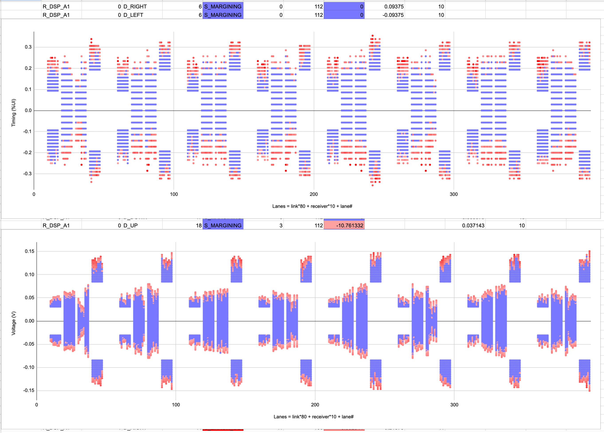

# PCIe-LMT (PCIe Lane Margin Test)
> ## sidedish: [PCIe-LTT](ltt/README.md) (Link Training Test)

\
\
The LMT (Lane Margin Test) checks the signal quality of the PCIe link. The test
utilizes the PCIe Lane Margining at Receiver (LMR) feature. The LMR is specified
in PCIe Base Spec 5.0 sections 4.2.13, 7.7.7 and 8.4.4. The LMR samples bits at each offset away from
the eye center and checks against the expected value at the eye center. This
test explores the error rate both timing-wise and voltage-wise. Here's a
[PCIe LMT Overview presentation](https://docs.google.com/presentation/d/1a5xyykoV7n4HS6U9ag1mB2jeEvyaLT4BICTSh0fEqXA)

## Features
### PCI-SIG LMR spec support:
- Supports both timing and voltage margining
- Supports retimer receivers
- Works with or without independent-error-sampler
- Supports both sample count and sample rate reporting methods

### Performance:
- Lane-parallel-margining for speed when independent-error-sampler presents
- Link-parallel-margining for speed
- Golang tool engine; Protobuf test spec and result. 

### Use cases and compatibility:
- Target offset pass-fail testing, or
- Eye scan with offset sweep: Start|Target|Step
- Eye-size checking or Eye-corner offset checking
- [OCP-Diag](https://github.com/opencomputeproject/ocp-diag-core/tree/main/json_spec) compliant artifact streaming
- Supports both x86 and ARM
- Linux-only: LMT uses the pciutils lib, which is behind the lspci and setpci tools.
- Colorful plotting in Google Sheet

A [lmt.proto](lmt.proto) specifies all aspects of the test, as well as logging the test result. The
top-level proto message specifies the PCIe link(s) to test. Each receiver point
(upstream port, downstream port, retimers) has a timing spec and/or a voltage
spec. For production testing, the test spec sets a target offset, a sample count
(or in terms of a minimum dwell time), and an error limit. The margining passes
if the error count is within the limit after checking the specified number of
bits at the timing/voltage offset. In characterization usage, the test steps
through incremental offsets and records the error rates. A companion flow plots
the error rates in a Google Sheets.



## Contributing

See [`CONTRIBUTING.md`](CONTRIBUTING.md) for details.

## License

Apache 2.0; see [`LICENSE`](LICENSE) for details.

## Disclaimer

This project is not an official Google project. It is not supported by
Google and Google specifically disclaims all warranties as to its quality,
merchantability, or fitness for a particular purpose.

## History
Version: 0.1 : demo  
Version: 1.0 : Not user friendly yet, but useful to those who understand it.

## Build and Run Commands:
```
# Not yet ported to the bzlmod required by bazel v8.0.1
# So build with v7.5.0 by using bazelisk
sudo npm install -g @bazel/bazelisk

USE_BAZEL_VERSION=7.5.0 bazelisk build -c opt :lmt

USE_BAZEL_VERSION=7.5.0 bazelisk build -c opt :lmt \
  --platforms=@io_bazel_rules_go//go/toolchain:linux_arm64_cgo  # ARM support

USE_BAZEL_VERSION=7.5.0 bazelisk run -c opt :lmt -- -h

bazel-bin/lmt_/lmt \
  -alsologtostderr -v=0 \
  -spec=dut_lmt_spec.pbtxt \
  -result=dut_lmt_result.pbtxt \
  -csv=dut_lmt_result.csv \
  -ocp_pipe=dut_lmt_ocp.json \
  -vendor_id=0x1000 -device_id=0xC030 \
  -bus=0x81,0xa1,0x63

bazel-bin/lmt_/lmt \
  -result2csv=dut_lmt_result.pbtxt \
  -csv=dut_lmt_result.csv
```

To plot the result in Google Sheets, make a copy of this [Google Sheet](https://docs.google.com/spreadsheets/d/1wdW-EsGtoSaoPytttZcERPhuQAR9PL04kxA6xuGm-hk)
Then import the dut_lmt_result.csv as a new sheet. Click the menu button `LMT
Plot` -> `Create Gradient Charts` to plot the charts.

## Test Spec and Result Examples
Refer to [lmt.proto](lmt.proto).

Test spec for eye-corner-scan:

```
test_specs: {
  aspect: M_VOLTAGE
  receiver: R_RTD_C3
  samples: 110 # log2(bits/3)
  dwell: 10  # seconds
  error_limit: 10  # max 63
  start_offset: 4
  step: 1
  # target_offset: 20
  # lane_number: 0
  eye_size: 0.050
}
```
Test spec for pass-fail:

```
test_specs: {
  aspect: M_TIMING
  receiver: R_USP_F6
  samples: 100  # 10^(samples/10) bits
  dwell: 3  # seconds
  error_limit: 1
  target_offset: 10  # 31/50%*15%=10
}
```

LMR parameters read from PHY hardware:

```
lane_parameter:  {
  num_timing_steps:  31
  max_timing_offset:  50
  ind_left_right_timing:  true
  voltage_supported:  true
  num_voltage_steps:  127
  max_voltage_offset:  49
  ind_up_down_voltage:  true
  ind_error_sampler:  true
  max_lanes:  15
}
```

Margin result:

```
timing_margins:  {
  direction:  D_RIGHT
  steps:  2
  status:  S_MARGINING
  sample_count:  112
  percent_ui:  0.057142857
}
voltage_margins:  {
  direction:  D_DOWN
  steps:  32
  status:  S_ERROR_OUT
  error_count:  12
  sample_count:  95
  voltage:  0.12346457
}
```

